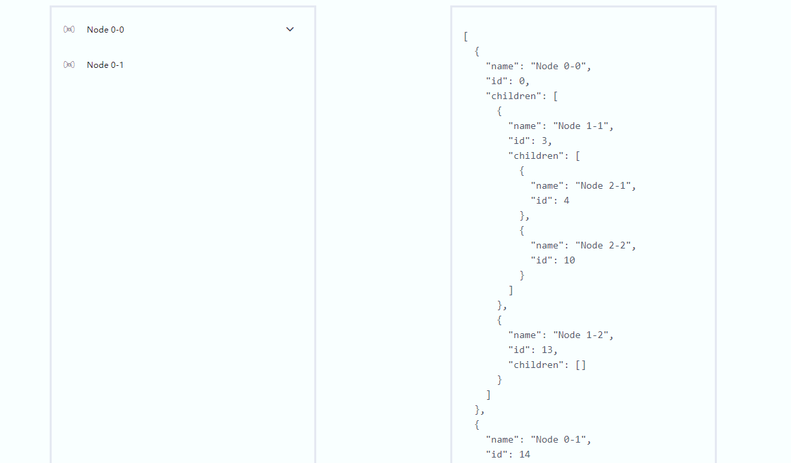

# ml-vue-drag-tree

> this pro is base on shuirong's [vue-drag-tree](https://github.com/shuirong/vue-drag-tree),thanks very much!

[](https://www.npmjs.com/package/ml-vue-drag-tree)[](https://www.npmjs.com/package/ml-vue-drag-tree)[](https://opensource.org/licenses/MIT)

> It's a tree components(Vue2.x) that allow you to drag and drop the node to exchange their data .Support **nested and list**

**Feature**

- **Drag and Drop** the tree node, even between two different levels
- **Controls** whether a particular node can **be dragged** and whether the node can be plugged into other nodes
- Support **nested and list**
- data and view **two-way-data-binding**

**[中文](README_ZH.md)** || **Please Star! if it's helpful**.
**[Example Project](https://github.com/qq240814476/ml-vue-drag-tree-demo)**

### Preview

---



### Getting Start

---

**Install**

`npm install ml-vue-drag-tree --save`

**Usage**

[A Simple Project Using ml-vue-drag-tree](https://github.com/qq240814476/ml-vue-drag-tree-demo)


main.js

```vue
import Vue from 'vue'
import VueDragTree from 'ml-vue-drag-tree'
import 'ml-vue-drag-tree/dist/vue-drag-tree.min.css'

Vue.use(VueDragTree)
```

### API

---

**Attributes**

| Name       | Description                                        | Type     | Default  |
| :--------- | :------------------------------------------------- | :------- | :------- |
| data       | data of the tree                                   | Array    | －－     |
| allowDrag  | Judging which node can be dragged                  | Function | ()=>true |
| allowDrop  | Judging which node can be plugged into other nodes | Function | ()=>true |
| openNames  | opened submenu names                               | Array    | ()=>[]   |
| activeName | actived menuitem id                                | String   | ''       |
| maxCharNum | text max show number in chinese char               | Number   | 6        |


**Events**

| Name                 | Description                                                                                                | arguments                                                                                                                    |
| -------------------- | ---------------------------------------------------------------------------------------------------------- | ---------------------------------------------------------------------------------------------------------------------------- |
| current-node-clicked | Tell you which node was clicked                                                                            | (model,component) model:  node data was clicked． component: VNode data for the node was clicked                             |
| drag                 | The `drag` event is fired every few hundred milliseconds as an node is being dragged by the user           | (model,component,e) model: node data was dragged. component: VNode data for the node was dragged; e: drag event              |
| drag-enter           | The `drag-enter` event is fired when a dragged node enters a valid drop target                             | (model,component,e) model: data of the valid drop target; component: VNode of the valid drop target; e: drag event           |
| drag-leave           | The `drag-leave` event is fired when a dragged node leaves a valid drop target                             | (model,component,e) model: data of the valid drop target; component: VNode of the valid drop target; e: drag event           |
| drag-over            | The `drag-over` event is fired when an node is being dragged over a valid drop target                      | (model,component,e) model: data of the valid drop target; component: VNode of the valid drop target; e: drag event           |
| drag-end             | The `drag-end` event is fired when a drag operation is being ended                                         | (model,component,e) model: node data was dragged. component: VNode data for the node was dragged; e: drag event              |
| drop                 | The **drop** event is fired when an node is dropped on a valid drop target.                                | (model,component,e) model: data of the valid drop target; component: VNode of the valid drop target; e: drag event           |
| on-data-change       | When Tree Data Change                                                                                      | (val) new **tree** data                                                                                                      |
| on-node-change       | When Node Data Change，return **event's type** and changed **parent node's data** and **drag node's data** | (type, parentNode, node) type: 'remove'/'add' event's **type**  parentNode: changed parentNode node: dragged **node's** data |


**License**

---

[The 996ICU License (996ICU)](LICENSE)
